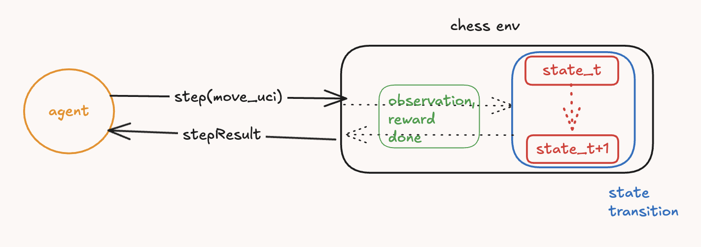

# SORLC (Scaling OpenEnv RL in Chess)

Idea is to learn the intuitions and built instinct for scaling RL. After procastinating for eons and juggling work, finally boarding the ship of RL and frontier AI (hopefully), thanks for the [Meta OpenEnv India Hackathon](https://pytorch.org/event/openenv-ai-hackathon/). Agenda of this repo would be to start from a basic chess engine with min-max pruning may be, then to move to stockfish-like engine, then scale it using open-env. (Yea, I am GPU-poor and tokens-poor!). Kindly bear with the messy, unpolished earlier commits.

## Set up

(make sure uv is installed!)

Sync packages to uv:

```sh
uv sync --extra dev --extra chess --extra openenv
```

I've two set ups here, one with traditional agent-environment interaction, the other with open-env style client-server communication. The key difference is that steps-reward exchange happens over a websocket in an isolated, dedicated container in open-env.



Project structure:

```sh
.
├── agent          # contains rl agent implementations, such as minimax
├── assets         # static assets for readme
├── chess_env      # rules, evaluation for chess_env, might wanna move this to envs/chess_env
├── envs           # env base class abstraction
├── examples       # examples with game plays and episodes
├── oenv           # open-env style impl of env and env-client (to talk to env server)
│   ├── client
│   └── server
├── orchestration  # for scaling/orchestration (out of scope)
├── tests          # tests
└── ui             # tkinter ui

12 directories

```

To run the tests to ensure things are in place: `uv run pytest`, or, directly start a game using one of the examples.

- `game.py`      : assumes agent-env interaction wo websockets.
- `oenv_game.py` : open-env style set up for agent-env interaction.

To start a game with ui render, follow the command:

```sh
uv run python -m examples.game --white minimax --black minimax --games 3 --ui
```

To manually play as white, add `--manual` to the command above. Check the `examples/` for more detailed cmd line control on params like `depth`, etc.

## Rough plan

- [x] chess engine with player.
- [x] basic rl agent to play and improve (min-max, or something).
- [x] think about abstraction here: engine as server environment, rl agent as client.
- [x] move to open-env.
- [ ] scale open-env from one client-server to multiple to run and evaluate multiple strategies.
- [ ] automate scaling (spawning) servers as a k8s task (like kubernete meets open-env, not sure if this has been attempted yet from open-env context at all, can do a search and confirm).
